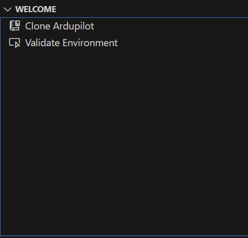
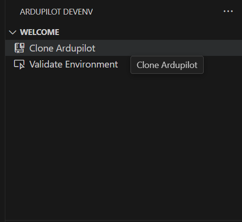

# ArduPilot VS Code Development Environment

This extension is developed to provide set of tools to improve quality of life for devs using Visual Studio Code for development. Currently only basic function to generate build tasks is added. Contributions, recommendations and issue reports are welcome!

## Table of Contents

1. [Introduction](#introduction)
2. [Installation](#installation)
3. [Extension Interface](#extension-interface)
   - [Welcome View](#welcome-view)
   - [Build Configurations View](#build-configurations-view)
   - [Actions View](#actions-view)
   - [Connected Devices View](#connected-devices-view)
4. [Getting Started](#getting-started)
   - [Cloning the ArduPilot Repository](#cloning-the-ardupilot-repository)
   - [Opening an Existing Repository](#opening-an-existing-repository)
5. [Environment Validation](#environment-validation)
   - [Required Tools](#required-tools)
   - [Configuring Custom Tool Paths](#configuring-custom-tool-paths)
6. [Managing Build Configurations](#managing-build-configurations)
   - [Creating Build Configurations](#creating-build-configurations)
   - [Editing Build Configurations](#editing-build-configurations)
   - [Deleting Build Configurations](#deleting-build-configurations)
   - [Setting the Active Configuration](#setting-the-active-configuration)
7. [Working with ArduPilot Firmware](#working-with-ardupilot-firmware)
   - [Building Firmware](#building-firmware)
   - [Uploading Firmware](#uploading-firmware)
   - [Debugging Firmware](#debugging-firmware)
8. [Feature Configuration](#feature-configuration)
   - [Enabling/Disabling Features](#enablingdisabling-features)
9. [Connected Devices](#connected-devices)
   - [Viewing Connected Devices](#viewing-connected-devices)
   - [MAVProxy Integration](#mavproxy-integration)
10. [SITL Simulation](#sitl-simulation)
    - [Setting Up SITL](#setting-up-sitl)
    - [Running Simulations](#running-simulations)
11. [Task System Integration](#task-system-integration)
    - [Task Configuration](#task-configuration)
    - [Running Tasks](#running-tasks)
12. [Troubleshooting](#troubleshooting)
    - [Build Issues](#build-issues)
    - [Device Connection Issues](#device-connection-issues)
    - [SITL Issues](#sitl-issues)
    - [Debug Issues](#debug-issues)
13. [Additional Resources](#additional-resources)

## Introduction

The ArduPilot VS Code Development Environment extension provides a comprehensive integrated development environment for ArduPilot firmware development directly within Visual Studio Code. This extension streamlines common development tasks and provides tools to improve your workflow when developing for ArduPilot-based systems.

Key features include:
- ArduPilot repository management
- Build configuration management for different boards and vehicle types
- Integrated firmware building and uploading
- Connected device detection and management
- MAVProxy integration
- SITL (Software-In-The-Loop) simulation support
- Environment validation

## Installation

### Prerequisites

Before installing the extension, ensure you have:
- Visual Studio Code 1.63.0 or newer
- Git installed and configured
- Python 3.x installed
- For hardware targets: ARM GCC toolchain (arm-none-eabi-gcc)
- For debugging: GDB (arm-none-eabi-gdb or gdb-multiarch)

### Installation Steps

1. Open Visual Studio Code
2. Go to the Extensions view (Ctrl+Shift+X or View > Extensions)
3. Search for "ArduPilot DevEnv"
4. Click "Install" on the "ardupilot-devenv" extension
5. The extension will automatically install required dependencies:
   - Cortex-Debug extension (marus25.cortex-debug)
   - C/C++ Tools extension (ms-vscode.cpptools)


## Extension Interface

The extension adds a dedicated activity bar icon that provides access to four main views:

### Welcome View

The Welcome view is the starting point for using the extension. It provides:
- Quick links to common actions
- Information about the extension
- Environment setup assistance



### Build Configurations View

This view allows you to manage different build configurations for ArduPilot firmware:
- Create, edit, and delete build configurations
- Set the active configuration
- Build firmware for specific configurations

Each configuration includes:
- Target board (e.g., CubeOrange, Pixhawk, SITL)
- Vehicle type (e.g., copter, plane, rover)
- Build options
- Feature selections


### Actions View

The Actions view provides quick access to common tasks based on your active configuration:
- Build firmware
- Debug firmware
- Upload firmware
- Run SITL simulation


### Connected Devices View

This view shows USB devices connected to your computer that may be ArduPilot compatible:
- Lists all connected USB devices
- Shows device details (port, manufacturer, product)
- Provides options to connect via MAVProxy
- Shows connection status


## Getting Started

### Cloning the ArduPilot Repository

If you don't already have the ArduPilot source code, the extension can clone it for you:

1. In the Activity Bar, click on the ArduPilot DevEnv icon
2. In the Welcome view, click on "Clone ArduPilot"
3. Select a destination directory
4. Optionally specify a different directory name (defaults to "ardupilot")
5. Wait for the cloning process to complete
6. The repository will be added to your workspace



### Opening an Existing Repository

If you already have an ArduPilot repository:

1. In VS Code, select File > Open Folder...
2. Navigate to and select your ArduPilot repository folder
3. Click "Open"
4. The extension will automatically detect the ArduPilot repository and enable its features

## Environment Validation

### Required Tools

The extension can validate your development environment to ensure all required tools are available:

1. From the Welcome view, select "Validate Environment"
2. The extension checks for:
   - Python 3
   - MAVProxy
   - arm-none-eabi-gcc (ARM GCC toolchain)
   - arm-none-eabi-gdb / gdb-multiarch
   - ccache (recommended for faster builds)
   - JLinkGDBServerCLExe (optional for SEGGER J-Link debugging)
   - OpenOCD (optional for JTAG/SWD debugging)

3. For each tool, the validator shows:
   - Tool status (Available/Missing)
   - Version information
   - Path where the tool was found


### Configuring Custom Tool Paths

If a tool is installed but not in the standard location:

1. In the Environment Validator, click "Configure Path" next to the missing tool
2. Browse to select the executable file
3. The extension will verify the tool and save the custom path
4. Custom paths are remembered between sessions

To reset all custom paths:
1. Click "Reset All Paths" at the bottom of the validator
2. Confirm the reset when prompted


## Managing Build Configurations

### Creating Build Configurations

1. In the Build Configurations view, click the "+" icon or "New Build Configuration"
2. In the configuration panel:
   
   **Basic Configuration:**
   - Select a target board (e.g., "CubeOrange", "Pixhawk4", "SITL")
   - Select a vehicle type (e.g., "copter", "plane", "rover")
   
   **Advanced Options:**
   - Configure Options: Add waf configure options (e.g., "--debug")
   - Build Options: Add waf build options (e.g., "--upload")
   - Enable Feature Configuration: Toggle to enable fine-tuning of firmware features
   
   **SITL Configuration (when SITL board is selected):**
   - Frame Type: Select vehicle frame (e.g., "quad", "hexa")
   - Additional Parameters: Set SITL-specific options

3. Click "Create Build Configuration" to save


### Editing Build Configurations

1. In the Build Configurations view, find the configuration to edit
2. Click the pencil icon or right-click and select "Edit"
3. Make changes in the configuration panel
4. Click "Save" to update the configuration

### Deleting Build Configurations

1. In the Build Configurations view, find the configuration to delete
2. Click the trash icon or right-click and select "Delete"
3. Confirm deletion when prompted

### Setting the Active Configuration

1. In the Build Configurations view, find the configuration to activate
2. Click the star icon or right-click and select "Set as Active Configuration"
3. The active configuration will be highlighted and available in the Actions view


## Working with ArduPilot Firmware

### Building Firmware

**From the Build Configurations view:**
1. Find the configuration to build
2. Click the tools icon or right-click and select "Build Firmware"
3. The build process will start in a terminal window
4. Build output and errors will be displayed in the terminal
5. The Problems panel will show compilation errors and warnings

**From the Actions view (with active configuration):**
1. Click "Build Firmware"
2. The build will start as described above


### Uploading Firmware

**From the Actions view:**
1. Click "Upload Firmware"
2. If configured, the firmware will be built first
3. The compiled firmware will be uploaded to the connected board
4. Upload status will be shown in the terminal


### Debugging Firmware

**For hardware targets:**
1. Connect your board via a compatible debug probe
2. In the Actions view, click "Debug Firmware"
3. VS Code will start a debug session using the Cortex-Debug extension
4. You can set breakpoints, inspect variables, and step through code

**For SITL targets:**
1. In the Actions view, click "Debug Firmware"
2. A SITL instance will start in debug mode
3. You can debug the ArduPilot code running in the simulator


## Feature Configuration

When creating or editing a build configuration, you can enable the Feature Configuration option to fine-tune which ArduPilot features are included in the build.

### Enabling/Disabling Features

1. In the build configuration panel, check "Enable Feature Configuration"
2. Initial build is required to extract features after enabling.
3. The Features section will expand to show available features.
4. Check or uncheck features to enable or disable them
5. These selections are passed to the ArduPilot build system


## Connected Devices

### Viewing Connected Devices

1. In the Connected Devices view, all USB devices connected to your computer will be listed
2. Each device shows:
   - Port (e.g., /dev/ttyACM0, COM3)
   - Manufacturer and product name
   - Serial number (if available)
   - Icon indicating ArduPilot compatibility (when detected)
3. Click the refresh button to update the list of connected devices


### MAVProxy Integration

MAVProxy is a command-line ground station software that allows you to interact with ArduPilot devices.

**Connecting to a device:**
1. In the Connected Devices view, find the device you want to connect to
2. Click "Connect MAVProxy" or right-click and select "Connect MAVProxy"
3. Enter the baud rate when prompted (default is 115200)
4. A terminal window will open running MAVProxy connected to your device
5. You can now interact with the device using MAVProxy commands

**Disconnecting:**
1. In the Connected Devices view, find the connected device
2. Click "Disconnect" or right-click and select "Disconnect"
3. The MAVProxy connection will be terminated


## SITL Simulation

Software-In-The-Loop (SITL) allows you to run ArduPilot code without physical hardware.

### Setting Up SITL

1. Create a new build configuration:
   - Select "SITL" as the board
   - Select your desired vehicle type (e.g., "copter", "plane", "rover")
   - Configure SITL options through args:
     - Frame type (e.g., -f +)
     - Additional parameters (e.g., "-L CMAC" for CMAC location)
2. Click "Create Build Configuration" to save
3. Set this configuration as active


### Running Simulations

1. With a SITL configuration active, go to the Actions view
2. Click "Run SITL Simulation"
3. The SITL process will start in a terminal window
4. By default, SITL will connect to MAVProxy for interaction


## Task System Integration

The extension integrates with VS Code's task system to provide ArduPilot-specific tasks.

### Task Configuration

The extension contributes a task type "ardupilot" with the following properties:

```json
{
  "type": "ardupilot",
  "configure": "BoardName",     // Board configuration (required)
  "target": "vehicle",          // Target vehicle type (required)
  "configureOptions": "",       // waf configure options
  "buildOptions": "",           // waf build options
  "waffile": "",                // Custom waf file location
  "buildBeforeUpload": true,    // Whether to build before uploading
  "features": [],               // Features to enable/disable
  "simVehicleCommand": ""       // SITL-specific options
}
```

## Additional Resources

- [ArduPilot Development Website](https://ardupilot.org/dev/index.html)
- [ArduPilot GitHub Repository](https://github.com/ArduPilot/ardupilot)
- [Extension GitHub Repository](https://github.com/ardupilot/ardupilot_vscode_devenv)
- [VS Code Documentation](https://code.visualstudio.com/docs)

For issues, feature requests, or contributions:
- [GitHub Issues](https://github.com/ardupilot/ardupilot_vscode_devenv/issues)
- [GitHub Pull Requests](https://github.com/ardupilot/ardupilot_vscode_devenv/pulls)


## Release Notes

### 0.0.1

* Add basic support of generating build tasks for ardupilot boards and vehicles

-----------------------------------------------------------------------------------------------------------

## Working with Ardupilot

Refer the docs [ArduPilot Development Site](https://ardupilot.org/dev/index.html)

**Enjoy!**
